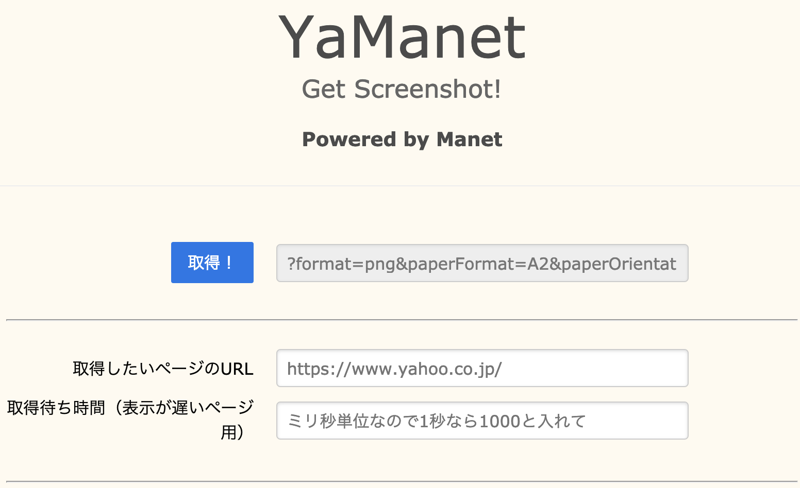
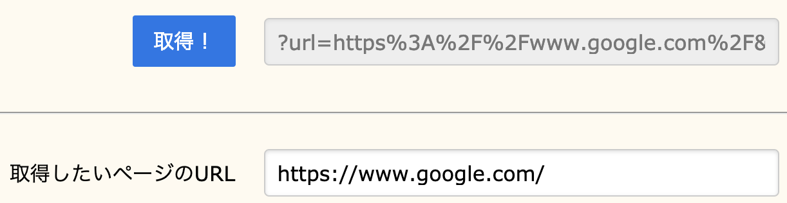
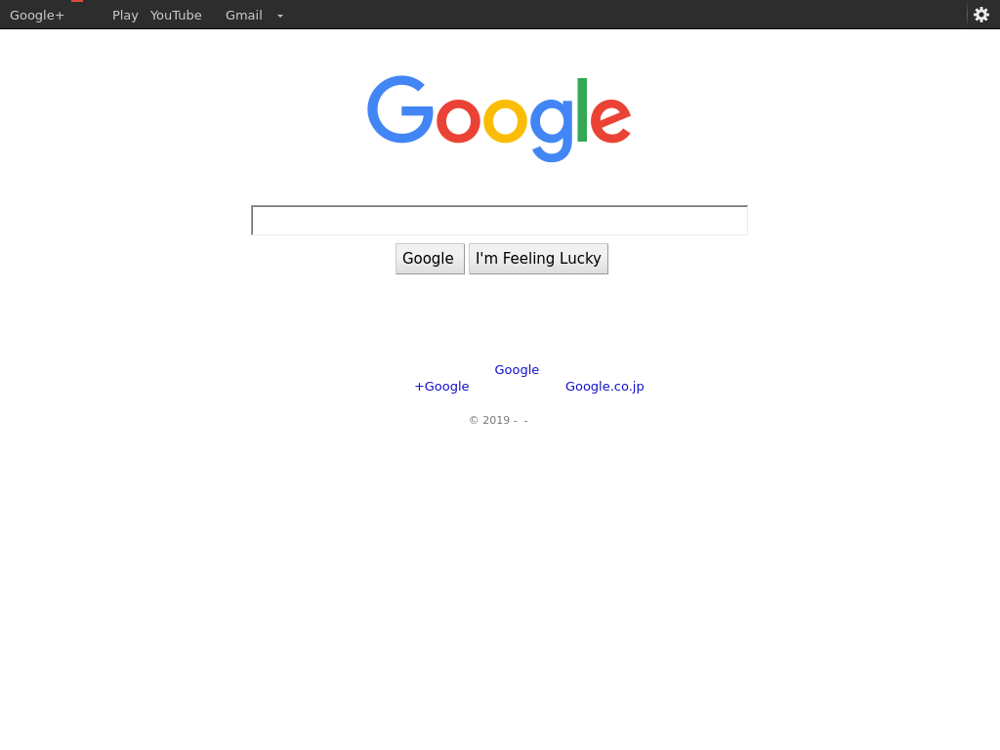

<!-- [](https://circleci.com/gh/corselia/yamanet) -->
# PhantomJS is now obsolete so this repository is frozen

# YaManet
**Yet another Manet**

# What is Manet?
- An awesome app
- https://github.com/vbauer/manet

# Installation

## git clone and yarn install (npm install)
```bash
$ git clone git@github.com:corselia/yamanet.git
$ cd yamanet
$ yarn install
```

## Edit a configuration file
- Please refer an official document
    - https://github.com/vbauer/manet/blob/master/README.md

```bash
$ vim ./to_copy_files/config/default.yaml
```

## Copy a configuration file and web front files
- If you change web front files, edit [to_copy_files/public/*](/to_copy_files/public)

```bash
$ cp ./to_copy_files/config/default.yaml ./node_modules/manet/src/config
$ cp -r ./to_copy_files/public ./node_modules/manet
```

# Boot YaManet
```bash
$ ./start_yamanet.sh
```

# Stop YaManet
```bash
$ pkill -f manet
```

# Note
- If you want to use Japanese or other language's font, you may install it as below in case of Japanese on Ubuntu

```bash
$ sudo apt-get install fontconfig
$ wget --content-disposition IPAfont00303.zip http://ipafont.ipa.go.jp/old/ipafont/IPAfont00303.php
$ sudo unzip IPAfont00303.zip -d /usr/share/fonts/
$ sudo fc-cache -fv
```

- If you use OS X, perhaps it doesn't work correctly. Please refer a following issue.
    - https://github.com/nwjs-community/nw-builder/issues/75
- If you use Raspberry Pi, maybe you cannot use `PhantomJS` because its architecture is ARM

# CAUTION
If you use a low spec cpu or/and you access to `YaManet` by multiple web browsers's tabs, it may hang up. In my case, when I use a [Lightsail](https://aws.amazon.com/jp/lightsail/pricing/) 512MB plan, that's so. I assume the reason is a problem of `PhantomJS` but it is no longer maintenanced.

# LICENSE
- [MIT LICENSE](/LICENSE)

# Screenshots





